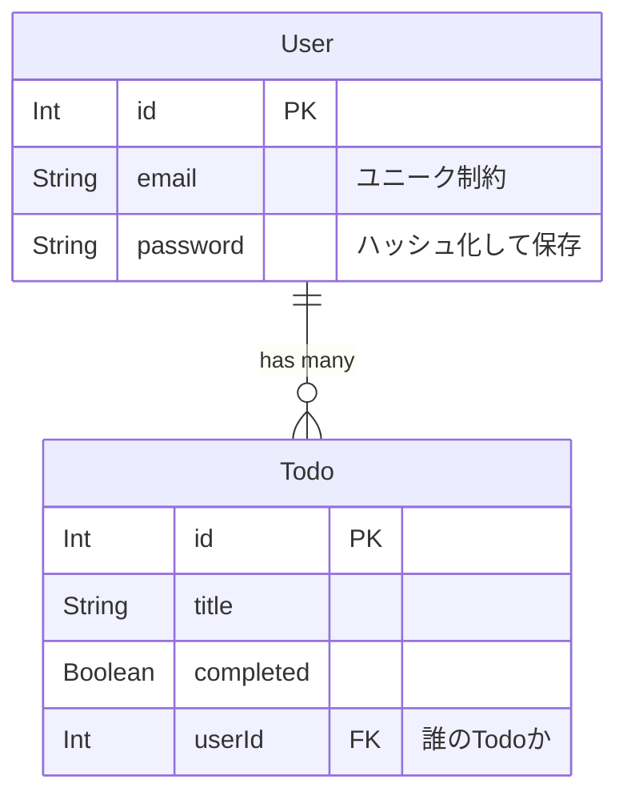

# 認証機能 技術仕様書 (学習用)

このドキュメントでは、今回実装する「JWT認証機能」の仕組みと技術詳細について解説します。

## 1. 認証の仕組み: JWT (JSON Web Token)

今回は **JWT (ジェイ・ダブリュー・ティー)** という技術を使います。
これは、サーバーがユーザーに発行する「デジタル署名付きの通行手形」のようなものです。

### 従来のセッション認証 vs JWT認証

- **セッション認証 (従来)**:
  - サーバー側で「誰がログイン中か」をメモリやDBに記憶します。
  - ユーザーは「セッションID」だけを持ちます。
  - サーバーのメモリ負荷がかかる場合があります。

- **JWT認証 (今回)**:
  - サーバーは「ログイン中」という状態を**記憶しません** (ステートレス)。
  - その代わり、ユーザー情報を含んだ「暗号化署名付きトークン(チケット)」をユーザーに渡します。
  - ユーザーが次回アクセスする際、そのチケットを見せることで「私は〇〇です」と証明します。
  - サーバーはチケットの署名を検証するだけで良いため、負荷が軽いです。

## 2. 実装詳細

### A. データベース設計 (Prisma)

`User` (ユーザー) と `Todo` (タスク) の関係を作ります。
「1人のユーザーは、たくさんのTodoを持つ」という **1対多 (1:n)** の関係です。



- **なぜ `userId` が必要？**:
  - これがないと、誰が作ったTodoなのか区別がつかず、全員のTodoが混ざって見えてしまいます。

### B. パスワードのセキュリティ (bcrypt)

データベースにパスワードをそのまま(平文で)保存するのは**絶対NG**です。
万が一データが流出した際、パスワードが丸見えになってしまうからです。

今回は `bcrypt` (ビークリプト) というライブラリを使って、**ハッシュ化**して保存します。

- 入力: `password123`
- 保存: `$2b$10$X8...` (復元不可能なランダムな文字列)

ログイン時は、「入力されたパスワードを同じ方法でハッシュ化し、保存されたものと一致するか」を確認します。

### C. クライアント(React) と サーバー(Express) のやり取り

#### 1. 新規登録 (Register)
1. React: ユーザーがメール・パスワード入力 → POST送信
2. Server: パスワードをハッシュ化 → DBに `User` として保存
3. Server: 成功メッセージを返す

#### 2. ログイン (Login)
1. React: メール・パスワード送信
2. Server: DBからユーザー検索 → ハッシュ化パスワード照合
3. Server: OKなら **JWT (Token)** を発行して返す
4. React: 受け取ったTokenをブラウザの **LocalStorage** に保存 (`localStorage.setItem('token', ...)`)

#### 3. Todo一覧取得 (データ保護)
1. React: APIを呼ぶ際、保存したTokenをヘッダーに乗せる
   - `Authorization: Bearer <Token>`
2. Server (Middleware):
   - ヘッダーからTokenを取り出す
   - Tokenが偽造されていないか検証
   - Tokenの中身(userId)を使って、DBから「そのユーザーのTodo」だけを検索
3. Server: 結果を返す

## 3. フォルダ構成の変更点

```
server/
  controllers/
    authController.js  <-- [NEW] 登録・ログインのロジック
    todoController.js  <-- [UPDATE] userIdを使って検索・作成するように変更
  middleware/
    auth.js            <-- [NEW] 「トークン持ってる？」を確認する門番
  routes/
    auth.js            <-- [NEW] /register, /login の受付
```
